  <h3><code>meetd99@github ~ $ ./contributions.sh</code></h3>
  

    

  <h3><code>meetd99@github ~ $ whoami</code></h3>
  <table>
    <tr>
      <td valign="top"></td>
      <td valign="top"></td>
    </tr>
  </table>

   
   

  <h3><code>meetd99@github ~ $ ./links.sh</code></h3>

  
<b>Developer · Designer · Learner</b>

  
  
  
 

